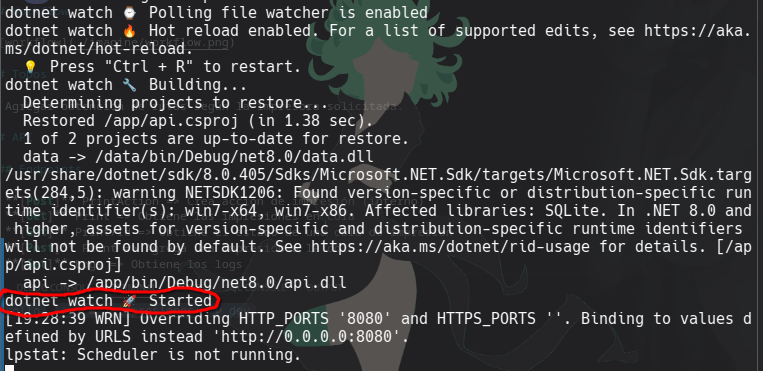
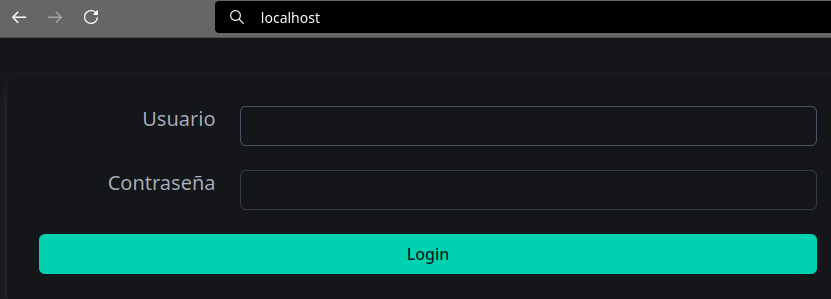

# MRCD

MRCD es un sistema, pretensiosamente como ERP, orientado al registro de información personal, bastante básico, y asistencias de estas personas. Se pueden llevar seguimientos de documentos personales entregables, cobros, asistencias, grados académicos y logs.

> **Nota**: El presente repositorio está pensado para ser ejecutado y desarrollado en contenedores, por lo que los entornos, como Node, no serán necesarios a menos que el desarrollador prefiera instalar las dependencias manualmente en su sistema.

- [1. Requisitos](#1-requisitos)
- [2. Get started](#2-get-started)
- [2.1. Desarrollo en contenedores](#21-desarrollo-en-contenedores)
- [2.1.1. Página](#211-página)
- [2.1.2. Puertos](#212-puertos)
- [2.2. Orquestación de prueba](#22-orquestación-de-prueba)
- [3. Configuración](#3-configuración)
- [3.1. Base de datos](#31-base-de-datos)
- [4. Arquitectura](#4-arquitectura)
- [4.1. Casos de lógica de Workflow](#41-casos-de-lógica-de-workflow)
- [5. ToDos](#5-todos)

## 1. Requisitos

- [Docker](https://docs.docker.com/get-started/get-docker/)
- [dotnet-sdk-8.0](https://learn.microsoft.com/en-gb/dotnet/core/install/)

## 2. Get started

### 2.1. Desarrollo en contenedores

Para hacer cambios en el código, podemos usar el siguiente comando para levantar el entorno que se requira modificar:

```terminal
docker-compose --profile [profile] up -d
```

Los perfiles que podemos seleccionar serán los siguientes:

- dev: Levanta la API y el cliente.
- api
- prod: Compila el código del cliente y la API, posteriormente lo sirve en Nginx por HTTP.

Ejemplo para modificar la API:

```terminal
docker-compose --profile api up -d && clear && docker logs -f api
```

Tomar en cuenta la _API_ tiene Dotnet Watch para ver los cambios que se hagan en el código, pero en cambios grandes como eliminación o agregación de servicios, es probable que se requiera relanzar el contenedor:

```terminal
docker rm -f [container] && docker-compose --profile [profile] up -d
```

> Cambiar `[container]` por el nombre del contendor que se quiere reiniciar o seguir.

Tomar en cuenta que se deben esperar unos minutos antes de usar los contenedores de la API, ya que se restauran dependencias y proyectos. Los contenedores estarán listos para usarse cuando _dotnet watch_  haya inicado:



Se montan volúmenes en los contenedores, por lo que podemos abrir el código del repositorio en cualquier IDE y realizar los cambios desde allí, los contenedores detectarán los cambios y compilarán nuevamente. Tomar en cuenta que al ser contenedores, para temas de _debuging_ habrán que hacer pasos adicionales en el IDE y compilar localmente la API.

#### 2.1.1. Página

En caso de levantar la página para ediciones, es posible que nos de un error la primera vez al lanzar el contenedor. Esto se da porque, al montar el volumen entre el repositorio con el código y el contenedor, Node no encuentra las dependencias necesarias para levantar el proyecto. Para solucionar esto, la primera vez que se clona el repositorio, deberemos dirigirnos a la carpeta del proyecto e instalar las dependencias en nuestro host; podemos usar Docker para seguir manteniendo nuestro sistema limpio:

```terminal
cd ./sys
docker run --rm --name builder -v "$(pwd):/app" -w /app node:22-alpine npm install
```

Una vez hayamos descargado las dependencias en nuestro host podremos lanzar la página.
**Nota**: Aunque intentemos acceder en el navegador a la página, no se encontrará el sitio. Esto es porque adicionalmente deberemos levantar el proyecto dentro del servidor:

```terminal
docker exec -it page sh
clear && ng serve --host 0.0.0.0 --port 4300
```

Note que en el contenedor ya se cuenta con Node y Angular, por lo que se puede usar _npm_ y _ng_ para gestionar paquetes, componentes, etc.

#### 2.1.2. Puertos

- Por defecto el puerto para ingresar a la págia es `8082` en todos los perfiles, a excepción de `prod`, dado que para este perfil se genera un servidor Nginx en el puerto `80`.
- Para ingresar a la API usamos el puerto `8080`, seguido de "swagger" para interactuar con sus endpoints gráficamente: `8080/swagger`. En caso de ser el perfil `prod`, no podremos usar swagger, dado que todo es gestionado por Nginx, así que deberemos usar la ruta del endpoint iniciando con `/api`: `localhost/api/[endpoint]`.

> Es recomendable asegurarse que estos puertos no estén en uso antes de lanzar los contenedores, en caso contrario deberemos cambiar los puertos de los contenedores o detener los servicios que ocupan dichos puertos.

### 2.2. Orquestación de prueba

En caso de querer levantar el entorno sin hacer modificaciones al código (o después de), usar imágenes ligeras o construir las aplicaciones, podemos ejecutar el siguiente comando:

```terminal
docker-compose --profile prod up -d
```

Esto compilará todos los proyectos y levantará los contenedores necesarios. Para validar que estén funcionando podremos ingresar a nuestro navegador y buscar `localhost`, nos debería mostrar la página:



Por defecto, las credenciales para ingresar son:
- Usuario: Misha
- Contraseña: Patit0!

## 3. Configuración

Las variables de entorno que se deben configurar se describen en el archivo [.env](./.env). Por defecto los valores de estas variables están configuradas para desarrollo en local y no hay que tocar nada, pero si requieres lanzarlo en producción deberás configurarlo manualmente en el proveedor de servicios en la nube.
Deberás quedarte con los servicios que tengan el perfil _prod_, salvo por la base de datos, para que se pueda ejecutar el docker-compose o kubernets sin usar otros perfiles de desarrollo.

- **DB**: Nombre de la base de datos.
- **PASSWD**: Contraseña para la base de datos.
- **SERVER**: Cadena de conexión para la base de datos.
- **ENVIRONMENT**
- **DOMAIN**
- **EKEY**: Llave para encriptar datos sensibles en la base de datos.

### 3.1. Base de datos

La API está diseñada para trabajar con MySQL, si el motor de base de datos es distinto, se deberán instalar los paquetes manualmente en la API y verificar que no _se rompa_, así como efectuar las migraciones manualmente. Good lock!

Por defecto se deben contar con los siguientes registros ya creados en la base de datos:

- Usuario con roles: sys y adm.
- Tres ActionsLogs.

Si se require hacer una restauración de la base de datos para evitar las migraciones manuales, verificar el archivo [backup.sql](./db/backup.sql).

## 4. Arquitectura

```
/
├─ api/
├─ db/
└─ sys/
```

### 4.1. Casos de lógica de workflow

- Una vez que se agreguen padrinos/encargados al confirmando, dicho confirmando no puede actualizarse para eliminar todos los padrinos/encargados.
- La inscripción solo aparece si hay un registro. Cuando se elimina la inscripción de un confirmando y se vuelve a marcar, el valor de la inscripción cambiará al valor de la inscripción actual, no a la anterior.


## 5. ToDos

- Units tests.
- Alerta de inasistencias.
- Terminar de separar lógica de SQL.
- Agenda (all).
- Retirar la continuación del hilo explícito en funciones asíncronas.
- Revisar escanéos
