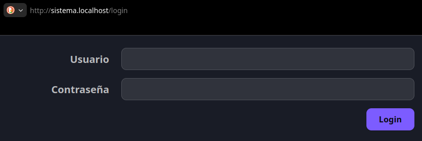
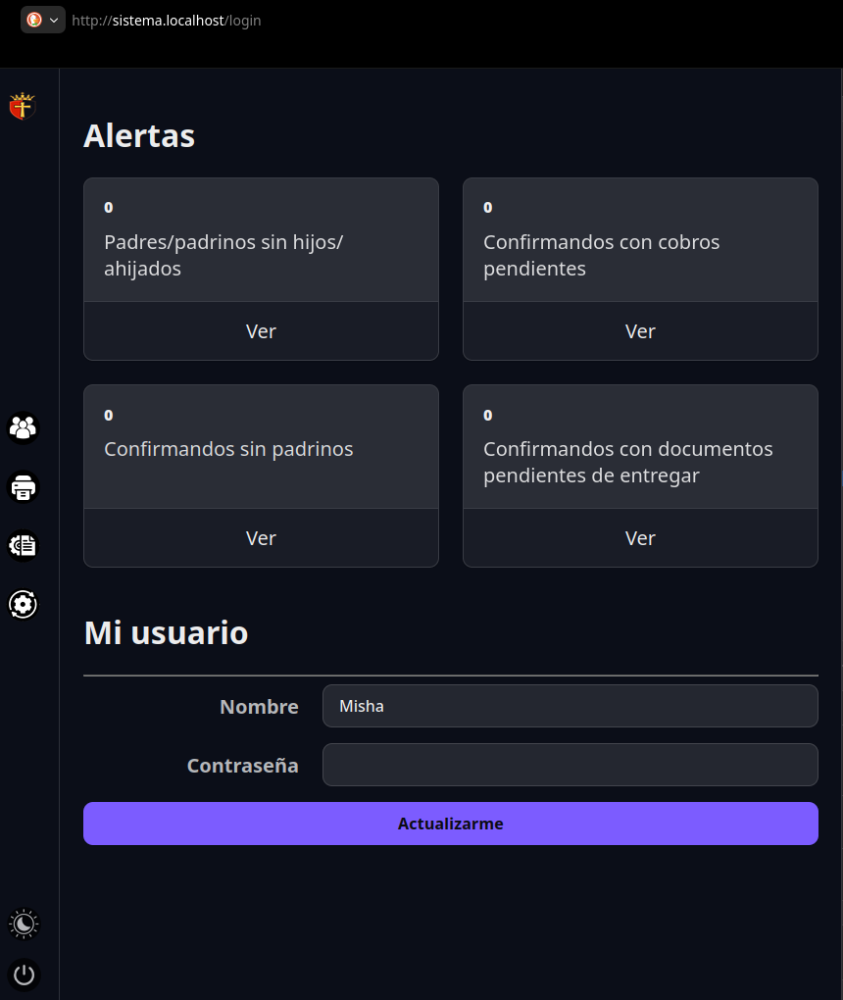

# MRCD

MRCD es un sistema, pretensiosamente como ERP, orientado al registro de información personal, bastante básico, y asistencias de estas personas. Se pueden llevar seguimientos de documentos personales entregables, cobros, asistencias, grados académicos y logs.

> **Nota**: El presente repositorio está pensado para ser ejecutado y desarrollado en contenedores, por lo que los entornos, como Node, no serán necesarios a menos que el desarrollador prefiera instalar las dependencias manualmente en su sistema.

- [1. Requisitos](#1-requisitos)
- [2. Get started](#2-get-started)
- [2.1. Desarrollo en contenedores](#21-desarrollo-en-contenedores)
- [2.1.1. Frontend](#211-frontend)
- [2.1.2. Puertos](#212-puertos)
- [2.2. Orquestación de prueba](#22-orquestacion-de-prueba)
- [3. Configuración](#3-configuración)
- [3.1. Base de datos](#31-base-de-datos)
- [3.2. Migraciones](#32-migraciones)
- [4. Arquitectura](#4-arquitectura)
- [5. ToDos](#5-todos)

## 1. Requisitos

- [Docker](https://docs.docker.com/get-started/get-docker/)

## 2. Get started

### 2.1. Desarrollo en contenedores

Tanto el _frontend_ como el _backend_ cuentan con archivos para `Devcontainer`, por lo que basta con instalar la extensión en el IDE, abrir la carpeta y _reabrir_ con la extensión para que el entorno sea funcional y no haya problemas con las dependencias.

#### 2.1.1. Frontend

En caso de querer modificcar el fronted, es necesario tener levantado el servicio de la API:

```terminal
docker compose up -d api
```

Una vez el servicio esté corriendo, se debe abrir el proyecto en Devcontainers y conectar ese contenedor a la red, para que se pueda consumir la API. Se puede ver el nombre del contenedor donde corre el frontend con el siguiente comando:


```terminal
docker ps --format "{{.Names}}"
```

Posteriormente se deberá conectar el contenedor a la red:


```terminal
docker network connect mrcd_network [FrontendContainerName]
```

Una vez los contenedores estén conectados, se puede levantar el proyecto con la terminal del IDE:

```terminal
clear && ng serve --host 0.0.0.0
```

> **Nota:** Es probable que se deban instalar las dependencias la primera vez, antes de levantar el proyecto:

```terminal
npm install
```

Nótese que en el contenedor ya se cuenta con Node y Angular, por lo que se puede usar _npm_ y _ng_ para gestionar paquetes, componentes, etc.

#### 2.1.2. Puertos

- Por defecto el puerto para ingresar a la UI es `80`, cuando el _server_ está corriendo, dado que este es el que levanta el Nginx.
- Para ingresar a la API se usa el puerto `8080`, seguido de "swagger" para interactuar con sus endpoints gráficamente: `localhost:8080/swagger`. En caso de que se modifique la variable [ASPNETCORE_ENVIRONMENT](./.env), no se podrá usar swagger, así que se deberá usar la ruta del endpoint iniciando con `/api/v2`: `localhost/api/v2/[endpoint]`.
- Los servicios para el caché y la BD no se exponen al host anfitrión, por lo que se debe preocupar de tener los puertos 6379 y 3306 disponibles.

> Es recomendable asegurarse que estos puertos no estén en uso antes de lanzar los contenedores, en caso contrario se deberán cambiar los puertos de los contenedores en el [docker-compose](./docker-compose.yml), o detener los servicios que ocupan dichos puertos.

### 2.2. Orquestación de prueba

Para probar todo el stack en local, antes o después de modificar el código (si así se requiere), basta con ejecutar el siguiente comando:

```terminal
clear; docker-compose up -d
```

Esto compilará todos los proyectos y levantará los contenedores necesarios. Para validar que estén funcionando se puede ingresar al navegador y buscar `localhost`.



Por defecto, las credenciales para ingresar son:
- Usuario: Misha
- Contraseña: Patit0!



## 3. Configuración

Las variables de entorno que se deben configurar se describen en el archivo [.env](./.env). Por defecto los valores de estas variables están configuradas para desarrollo en local por lo que, si se quiere usar en producción, se recomienda: cambiar credenciales de servicios, remover exposición de puertes con el host anfitrión y usar algún túnel para evitar exponer el stack (CloudFlare, por ejemplo).

**Variables para uso de caché**
- REDIS_PASSWORD: contraseña para servidor Redis.

**Variables de la base de datos**
-MYSQL_DATABASE: nombre de la base de datos.
-MYSQL_ROOT_PASSWORD: contraseña del usuario root.
-MYSQL_USER: usuario para CRUD básico de entidades.
-MYSQL_PASSWORD: contraseña del usuario no root.

**Variables para la API**
- ASPNETCORE_ENVIRONMENT: modo de la API. Con _development_ estará disponible Swagger.
- REDIS_CONNECTION: URI para la conexión del servicio del caché.
- DB_CONNECTION: URI para conexión a la base de datos.
- ENCRYPTION_KEY: llave de encriptación de datos sensibles en la base de datos. La longitud debe ser de 32 caracteres y, posteriormente, codificarla en base 64.
- JWT_ISSUER: identificador del emisor de los jWT para seguridad de endpoints.
- JWT_AUDIENCE: destinatario provisto del token para seguridad de endpoints.
- JWT_KEY: llave firma de los jWT.

**Variables para el servidor Nginx**
- DOMAIN
- API_URI: puerto y servidor de la API.
- API_PROTOCOL: protocolo por donde se llama a la API (http/https).

### 3.1. Base de datos

La API está diseñada para trabajar con MySQL, si el motor de base de datos es distinto, se deberán instalar los paquetes manualmente en la API y verificar que no _se rompa_, así como efectuar las respectivas migraciones. Good lock!

Si se require hacer una restauración de la base de datos para evitar las migraciones manuales, verificar el archivo [backup.sql](./db/backup.sql).

### 3.2. Migraciones

Para realizar migraciones en contenedores, se debe abrir el backend con Devcontainer. Una vez el contenedor esté conectado a la base de datos, se puede instalar EF:

```PowerShell
dotnet tool install --global dotnet-ef --version 8.0.24 &&
$env:PATH += ";/root/.dotnet/tools"
```

Al terminar de instalar EF, se puede realizar la migración como se realiza normalmente:

```PowerShell
dotnet ef migrations add [MigrationName] --project ./MRCD.Infrastrucutre --startup-project ./MRCD.API &&
dotnet ef database update
```

> Por defecto la cadena de conexión a la BD está en [appsettings](./backend/MRCD.API/appsettings.Development.json). En caso de que se esté trabajando con otra BD, se deberán modificar estas credenciales o se deberá exportar la conexión como variable de entorno dentro del contenedor.

## 4. Arquitectura

La APi utiliza el modelo de N capas: dominio, aplicación, infrastructura y host. Se utilizan handlers para cada caso de uso y se implementa el patrón repository.

```backend
backend/
├─ MRCD.Domain/
├─ MRCD.Application/
├─ MRCD.Infrastructure/
└─ MRCD.API/
```

## 5. ToDos

- Units tests.
- Alerta de inasistencias.
- Alerta de actividad fuera de horario.
- Registrar logs en entidad propia.
- Impresión de: diplomas y agenda.
- Páginas de: agenda, movimientos contables
